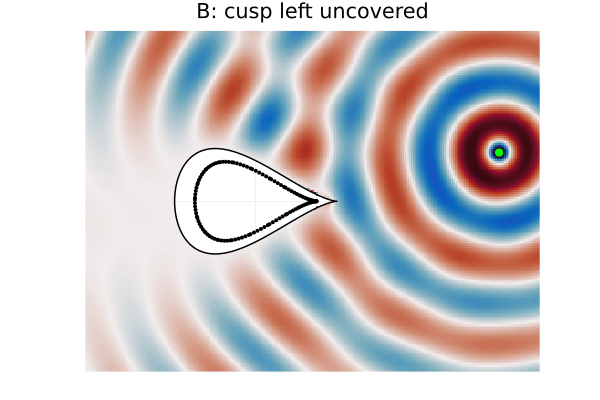
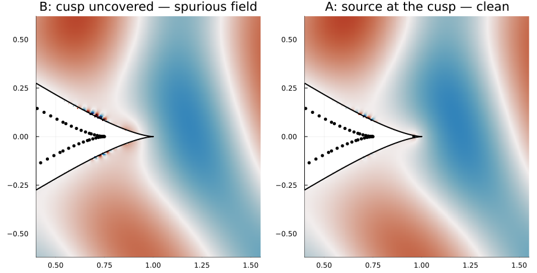
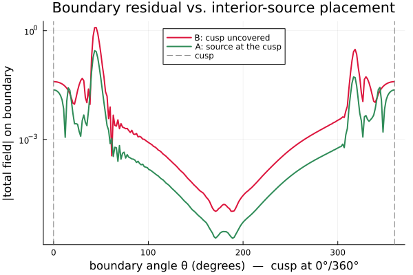

# Point-source scattering from a tear-drop scatterer

[`teardrop_scattering.jl`](teardrop_scattering.jl) solves for the acoustic field scattered by
a **sound-soft tear-drop** obstacle when it is illuminated by an incident **point source**, and
uses it to show how much the Method of Fundamental Solutions depends on *where the sources are
placed* near a geometric singularity — the tear-drop's **cusp**.

Run it from the package root:

```bash
julia --project docs/examples/acoustic/teardrop_scattering.jl
```

## Setup

- The obstacle is the tear-drop curve `(cos θ, sin θ·sin²(θ/2))`, which has a smooth bulb and a
  sharp **cusp** at `(1, 0)`.
- Sound-soft means the total pressure is zero on the boundary, so the scattered field must equal
  `−incident` there. The incident point source is supplied as a [`PointSource`](../../../src/transmission.jl)
  particular solution, so the returned `FundamentalSolution` evaluates to the **total** field.
- The scattered field is represented by MFS sources placed **inside** the obstacle, on a smooth
  curve obtained by shrinking the boundary toward the centroid. Shrinking pulls the curve away
  from the cusp tip, so the base set leaves the cusp uncovered.

The only thing that changes between the two runs is **one interior source next to the cusp**:

| | interior sources |
|---|---|
| **A** | base curve **+ one source at the cusp** (0.96, 0) |
| **B** | base curve only — cusp uncovered |

## The result

The total field (incident + scattered) over one period:

| A — source at the cusp | B — cusp uncovered |
|---|---|
|  |  |

In the far field the two look almost identical — the scattered pattern is set by the overall
shape. The difference lives in a thin layer right at the cusp.

## How the result depends on source placement

Zooming in on the cusp at a fixed phase, with a sensitive colour scale, the missing source shows
up as **spurious oscillations** hugging the boundary where the sources stop short (left); adding
one source at the cusp cleans it up (right):



Quantitatively, the boundary residual `|total field|` (which should be zero for a sound-soft
obstacle) tells the whole story. Away from the cusp both solutions are accurate to ~10⁻³; near
the cusp, leaving it uncovered lets the least-squares fit go wild:



```
max |total field| on the boundary
  A (source at the cusp):  0.28
  B (cusp uncovered):      1.22   ← larger than the incident field itself
```

## Takeaway

A cusp is a place where the boundary field varies faster than smooth, far-away sources can
represent. With **plain least squares** (`TikhonovSolver(λ = 0.0)`), omitting a source there does
not just add a little local error — it destabilises the whole fit, and spurious oscillations
appear along the boundary near the cusp. A single interior source placed next to the cusp gives
the fit the local degree of freedom it needs and restores an accurate, smooth solution. (Strong
regularisation would also suppress the oscillations, but at the cost of accuracy everywhere.)
