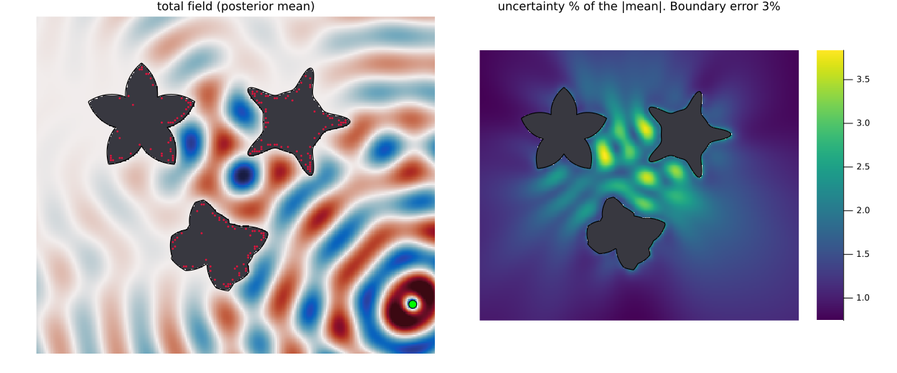
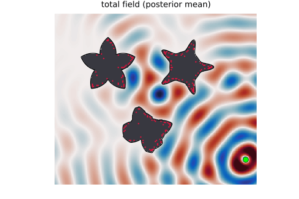
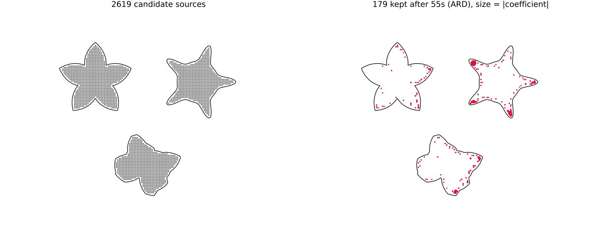

# Variational method examples

Two examples of the [`VariationalBayesianSolver`](../../../src/variational.jl): variational
evidence maximization with automatic relevance determination (ARD) over an overcomplete set
of candidate MFS sources.

Both need Plots.jl (not a dependency of this package): run them from an environment where
both `using MethodOfFundamentalSolutions` and `using Plots` work.

## Scattering from spikey obstacles: sources everywhere, ARD decides

[`spikey_scattering.jl`](spikey_scattering.jl) is the showcase: three strange obstacles
covered in spikes — a star and a shard with genuinely sharp (corner) spikes, and an urchin
with smooth but narrow ones — each carrying a **Dirichlet (sound-soft)** condition, lit by
an incident point source. Dirichlet obstacles are strong scatterers, and the three sit only
about half a wavelength apart, so the wave **rattles between them**: the multiple
scattering is visible as interference structure in the gaps.

With classical MFS this is exactly the kind of geometry where source placement is
make-or-break (see the [tear-drop example](../acoustic/teardrop_scattering.jl), where one
missing source at a cusp destabilises the whole fit). Here nobody thinks about placement:

- **Sources everywhere.** A blind regular grid carpets the inside of every obstacle
  (2619 candidates, 5238 coefficients — far more unknowns than the 1200 data). The grid
  does not know where the spikes are. (Sources must lie *inside* the obstacles, since each
  one is singular at its own position and the scattered field must be regular in the
  exterior.)
- **ARD prunes.** The solver learns a prior precision for every candidate coefficient and
  switches off the sources the data do not need, keeping ~180 of the 2619 in under a
  minute — clustered along the boundaries and reaching into the spike tips, all on its
  own (the run prints the exact pruning time).
- **Uncertainty for free.** The answer is a Gaussian posterior, so every point of the
  scattered field carries an uncertainty `s(x)`. The right panel of the main figure maps
  `s(x)` as a **percentage of the mean field magnitude** — it peaks at a few percent, and
  concentrates in the gaps between the obstacles, where the multiply-scattered field is
  hardest to pin down.

The posterior mean of the total field over one period:

What ARD did to the blind grid:

The Dirichlet condition is imposed as noisy data — every boundary sensor reports zero total
pressure to within a known noise σ (3% of the strongest boundary signal) — and the run
checks itself at fresh boundary points halfway between the sensors:

- `misfit_ratio ≈ 1.1`: the data are fitted to the specified noise level, not beyond it;
- the total field at fresh points is ≈ 0 to a few percent of the incident field;
- the posterior's own 3σ error bars cover the truth at ~90% of the fresh checks.

## Learning source positions for the Laplace equation

[`laplace_source_learning.jl`](laplace_source_learning.jl) reconstructs ten true point
sources from noisy boundary data on a disk, comparing ARD alone (sources everywhere, held
fixed) against ARD combined with the M-step over the source positions. It answers "can ARD
alone learn the sources?" — no: ARD is a subset selector, so recovering the true source
*positions* needs the position updates; but ARD alone is still an excellent *field* solver,
which is exactly how the scattering example above uses it.
