# Variational method examples

Four examples of the [`VariationalBayesianSolver`](../../../src/variational.jl): variational
evidence maximization with automatic relevance determination (ARD) over an overcomplete set
of candidate MFS sources.

All of them need Plots.jl (not a dependency of this package): run them from an environment
where both `using MethodOfFundamentalSolutions` and `using Plots` work.

## Where do you put the sources? Tikhonov MFS against the variational solver

[`star_tikhonov_vs_variational.jl`](star_tikhonov_vs_variational.jl) takes one sound-soft
obstacle — a smooth five-lobed star, `r(θ) = 0.75(1 + 0.2 sin 5θ)`, about 1.8 wavelengths
across — and asks the only question classical MFS really has: **where do the sources go?**

The boundary is **analytic**, and that is deliberate. An earlier version of this example used a
triangle wave, giving ten genuine corners, and they dominated every number in it: at a convex
tip the *exterior* wedge angle is 259°, so the local solution goes like `r^(π/ω) = r^0.69` and
its gradient is unbounded. The analytic continuation of the scattered field into the obstacle
then has a **branch point** sitting exactly on the tip — not a pole, so no finite sum of
fundamental solutions can represent it. Measured on that shape, the error in the tip band ran
18× the median for Tikhonov at half a step and 460× at one step, and every method's worst error
sat on the same five points. That is a statement about corner singularities, not about where
sources belong. With a smooth boundary the continuation reaches a finite depth, the sources
have something they can represent, and what is left is the question of *where*. (The boundary is
sampled at 35 points per wavelength and 4 points per minimum radius of curvature, so nothing
below is a resolution artefact either.)

The illumination is **symmetric**: five incident point sources on a ring, one on each of the
star's five symmetry axes, so the whole problem carries the star's own five-fold symmetry.
This is deliberate on both counts. It makes the pictures readable — every lobe is lit
identically, the boundary error repeats five times, and any structure left in a source layout
is structure the method *chose*. And it is the fairest possible setting for classical MFS: a
single off-centre source leaves half the boundary in shadow, where a uniform offset curve
spends sources on a stretch that carries almost no signal and the variational solver simply
declines to. (*Exactly* radially symmetric illumination is avoided on purpose: a trace that is
exactly radially symmetric on the boundary is matched exactly by a single monopole at the
centre, so the exact answer would be one source and the total field would vanish identically.
Five sources give the symmetry without the degeneracy.)

Both methods are judged by the same number: the residual of the Dirichlet condition at **2000
points along the whole boundary**, ten times denser than the 200 sensors either method is
allowed to fit, and interleaved with them so that no test point was ever fitted. The total
pressure vanishes on the boundary, so `|total field|` at a test point *is* the error.

**Every solve in this example uses noisy data** — the same 0.3% realisation from the same seed,
handed to Tikhonov as complex scalars and to the variational solver as `MvNormal`s. Exact
boundary values are not used anywhere. They would flatter Tikhonov out of all proportion (on an
analytic boundary it reaches rms 3e-5 with exact data, far below any noise floor), and no
measured boundary condition is ever exact.

### 1. Tikhonov cannot see its own error

Classical MFS puts one source behind every boundary point, a fixed offset in from the boundary:

| sources placed | residual at the 200 fitted sensors | whole boundary (max) | rms |
|---|---|---|---|
| ¼ step in  | 1.08e-2 | 1.78e-2 | 6.3e-3 |
| ½ step in  | 1.08e-2 | 1.07e-2 | 4.0e-3 |
| ¾ step in  | 1.08e-2 | 1.08e-2 | 4.0e-3 |
| 1 step in  | 1.08e-2 | 1.08e-2 | 4.0e-3 |
| 1½ steps in| **7.41e-3** | **7.43e-3** | **3.2e-3** |
| 2 steps in | 9.78e-3 | 9.97e-3 | 3.4e-3 |
| 3 steps in | 0.922 | 0.925 | 0.579 |

Two things to read off. First, **the residual is pinned at the noise level and carries almost no
information about the offset**: it sits at 1.08e-2 for every offset from ¼ to 1 step while the
true error over the whole boundary varies by 66% across the same range, and it is the *noise*
being interpolated, not the solution being good. Second, **the offset matters much less than
folklore suggests once the data are noisy** — everything from ¼ to 2 steps lands within a factor
of two of the best, because the noise floor and not the placement sets the error. Past two steps
the system is too ill-conditioned to fit at all, and there the residual finally does tell the
truth. The dramatic four-decade offset sensitivity that MFS is famous for is a *clean-data*
phenomenon.

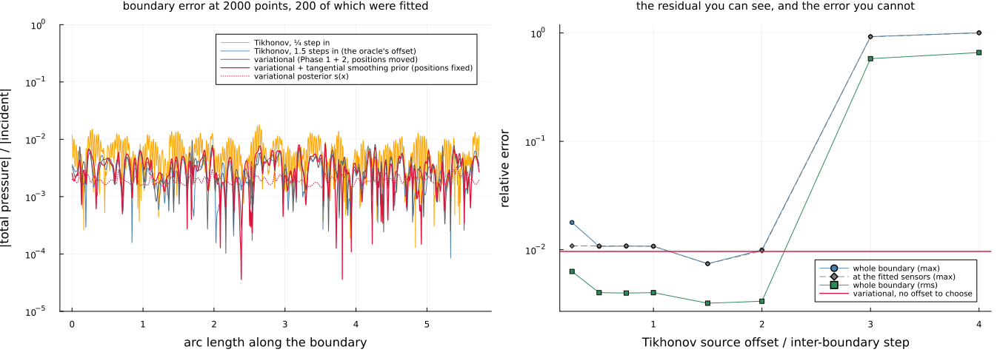

### 2. Variational: candidates everywhere, ARD selects, Phase 2 moves

Nobody chooses an offset. A blind 0.02 grid carpets the inside of the star (4419 candidates,
8838 coefficients against 400 data rows); Phase 1 starts from an empty basis and adds one
coefficient at a time by the exact evidence criterion (11 s, keeping 101); Phase 2 — Algorithm
1, entered at the positions *and* precisions Phase 1 finished with — then nudges the survivors
and prunes further, to **93 sources, rms 0.0035, max 0.0097**.

Like for like on the same data, against Tikhonov at the offset an *oracle* picks for it:

| | sources | rms | whole boundary (max) | offset chosen by |
|---|---|---|---|---|
| Tikhonov, 1½ steps in | 200 | **0.0032** | **0.0074** | an oracle sweeping 8 values |
| variational (Phase 1 + 2) | **93** | 0.0035 | 0.0097 | nobody |

It is a **tie** — 9% behind on rms, with fewer than half the sources and nothing tuned. That is
the honest headline, and it is a smaller claim than the corner version of this example made.
What the variational solver adds is not accuracy but two things you can act on: a posterior
standard deviation at every point, and the misfit diagnostic `R/N_g = 0.64`, which correctly
reports that the data have been fitted to the stated noise and no further. Tikhonov's best
offset here is 1½ steps, and you would only know that by already knowing the answer.

Three negative results worth stating, because the corner version reported them the other way:

- **Phase 2 barely moves anything.** Median travel is **0.065 of an inter-boundary step**, mean
  0.12, max 0.54 — against a candidate grid spaced 0.7 steps apart. It is sub-grid polish, and
  it costs 58 s to leave the boundary error where it was (rms 0.0034 before, 0.0035 after).
  Three reasons, all measurable in the run. Phase 1 has already chosen each source as a local
  evidence maximum over 4419 candidates, so the misfit gradient there is small. The descent in
  [`variational.jl`](../../../src/variational.jl) starts each trial step at a quarter of the
  source's distance to the boundary and **breaks at the first step that fails to reduce the
  misfit**, so a source travels only while every successive step strictly improves it. And the
  fit is already *below* the noise floor when Phase 2 starts (`R/N_g = 0.68 < 1`), so what is
  left of the misfit gradient is the noise realisation. Phase 2's real contribution here is the
  pruning, 101 → 93.

- **The tangential smoothing prior does nothing here.** Holding the Phase 1 positions fixed and
  asserting the sensors are located to ±¼ step *along* the boundary moves the roughness of the
  trace from 0.00369 to 0.00356 (3.5%) and the rms error from 0.0034 to 0.0036 — i.e. slightly
  the wrong way. The boundary is analytic and the sources were placed by evidence, so the fitted
  trace is already smooth and the prior has nothing to bite on. It earns its keep in section 3,
  where the sensors are genuinely wrong.
- **The posterior is a weak error indicator on this problem.** The correlation between
  `log s(x)` and `log|error|` over the 2000 test points is only **0.18**, and the median `s(x)`
  (0.0019) sits below the median error (0.0030). It is calibrated to the right order of
  magnitude, not to the spatial pattern.

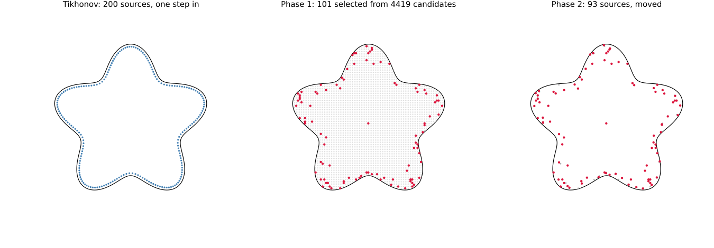

Note what the left panel *no longer* shows. On the corner version, offsetting every boundary
point inward by one step piled sources on top of each other at the convex tips and tore gaps
open in the valleys — a visible failure. On a smooth boundary the offset curve is perfectly
well-behaved, which is exactly why classical MFS does so well here. The variational layout is a
looser shell at a spread of depths; and although the candidate grid is Cartesian and knows
nothing of the star's symmetry, the selection comes out close to five-fold symmetric on its own.

### 3. Uncertain sensor positions: the tangential ridge

A boundary covariance enters the coefficient posterior as the ridge `Γ = Σᵣ wᵣ Gᵣ Σδx Gᵣᵀ`
with `Gᵣ = ∂Mᵣ/∂x`, so it is a **directional derivative penalty**, and the direction decides
what it does. Taken along the boundary **tangent**, `Σδx = σ² t tᵀ` gives

    aᵀΓa = σ² Σᵣ wᵣ |∂(M a)ᵣ/∂s|²

— the squared arc-length derivative of the fitted boundary trace. That is a **smoothness prior
along the boundary**, aimed squarely at the failure mode of section 1: a fit that honours its
200 collocation points and wanders between them. This is the only `Σx` the example uses.

With the sensors **exactly** on the boundary it is a knob with nothing to turn (see section 2:
3.5% off the roughness, nothing off the error). It matters when the sensors are genuinely
misplaced — each nominal position is the true one pushed off the curve along the normal by
σx ≈ 0.35 of a step, so imposing "total pressure = 0" there imposes a wrong condition. The true
displacement *has* to be normal: sliding a sensor along the boundary leaves it on the boundary
reporting the same value, so a tangential displacement is not an error at all. Both treatments
share one basis, and the error is measured on the **true** boundary (`rough` is the rms
variation of the trace across one inter-boundary step, relative to the incident amplitude):

| Σx is … | sources | ‖a‖ | max error | rms error | rough | `R/N_g` |
|---|---|---|---|---|---|---|
| ignored | 219 | 58.1 | 0.367 | 0.0468 | 0.0756 | 1.9 |
| **tangential** | 219 | **19.5** | **0.161** | **0.0310** | **0.0411** | 80 |

Ignoring the sensor error costs 51% on the rms and a factor of 2.3 on the worst point, and
inflates the coefficients threefold — the classic signature of a fit straining against
inconsistent constraints. Simply telling the solver its sensors are uncertain, and in which
direction, fixes most of it with nothing else changed.

This is a weaker effect than on the corner version, where ignoring `Σx` made the fit diverge
outright (‖a‖ = 918, error 230% of the incident field) and the rescue by Γ was a factor of 86.
A smooth boundary is a more forgiving problem, and every regularisation question on it is
correspondingly less dramatic.

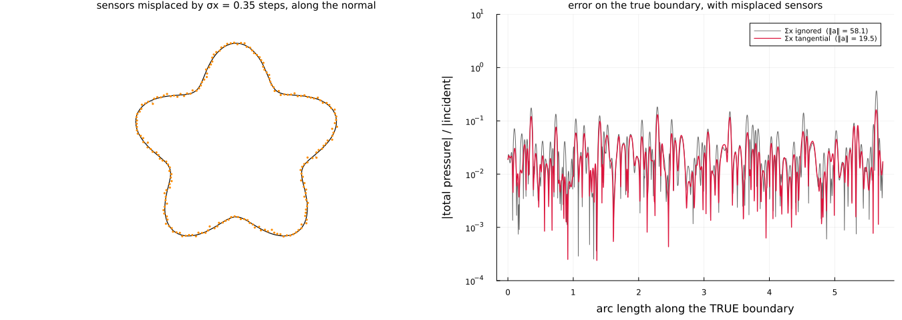

The example uses the ridge only, and never E-step II — the solver's other route, which infers
`δx` itself. Two reasons. A *tangential* `δx` is unidentifiable in the first place: sliding a
sensor along the boundary leaves it reporting the same value, so there is nothing to infer. And
E-step II rests on the linearization `M(x + δx) ≈ M + Σₖ Mₖ δxₖ`, where `M` varies on the scale
of a source's distance to the boundary, so a source closer than a few σx has no first-order
expansion and the `δx` estimated through it is meaningless (the solver warns about this). The
ridge is not subject to either objection: `Γ` is a well-defined quadratic penalty whatever `Σx`
is taken to mean, which is exactly why the tangential prior can be used as a pure smoothing knob
with σ set to the resolution you want rather than to a real displacement.

### 4. The sources follow the error in the data

Nothing about the layout is fixed in advance, so it responds to how good the data are:

| sensor noise σ | sources | median depth (steps) | 90th-percentile depth | cond(selected basis) | rms error |
|---|---|---|---|---|---|
| 0.1% | 123 | 1.4 | 4.6 | 2.6e4 | 0.0012 |
| 0.3% | 101 | 1.7 | 3.5 | 2.0e4 | 0.0034 |
| 1% | 88 | 0.95 | 3.5 | 2.0e3 | 0.0107 |
| 3% | 63 | 0.72 | 2.4 | 4.5e2 | 0.0302 |
| 10% | 41 | 0.50 | 1.5 | 1.2e2 | 0.0784 |

Noisier data buy fewer sources — a factor of three across two decades of σ — and **the deep ones
go first**: the 90th-percentile depth falls from 4.6 steps to 1.5 while the set collapses onto
the boundary. That is the opposite of what "noisier data need smoother solutions" would predict,
and the reason is **conditioning: depth is the physical parameterisation of the singular
spectrum.** A source at depth `d` produces a boundary trace of width `~d`, so deep sources are
broad and mutually near-parallel. Measured on 40 candidates per depth band, spread evenly around
the boundary:

| depth band (steps) | cond | singular values > 1e-2 of the largest | mean coherence with the rest |
|---|---|---|---|
| 0 – 0.5 | 15 | 40 / 40 | 0.78 |
| 1 – 2 | 98 | 40 / 40 | 0.80 |
| 4 – 8 | 1.7e3 | 27 / 40 | 0.88 |
| > 8 | 2.9e9 | 14 / 40 | 0.92 |

The evidence keeps adding directions until the next one is buried in the noise, so the condition
number of what it selects tracks the data precision (2.6e4 down to 1.2e2 across the sweep), and
"drop the directions you cannot resolve" reads geometrically as "drop the deep sources".
Classical MFS has no such mechanism: its layout is identical at every noise level.

**But what the evidence prefers is not what minimises the boundary error.** Restricting the same
candidate grid to sources deeper than two steps *beats* the free choice at both ends of the
range — rms 0.00098 against 0.0012 at σ = 0.1%, and 0.0665 against 0.0784 at σ = 10%, both with
about a third fewer sources. The marginal likelihood is evaluated at the 200 sensors and nowhere
else, and a shallow, sharply peaked column is better at explaining individual sensor values —
their noise included — than at representing the field between them. It is the same aliasing
failure that wrecks a corner-clustered basis under uniform sampling, in a much milder form, and
it is worth knowing about before trusting the layout the evidence hands you.

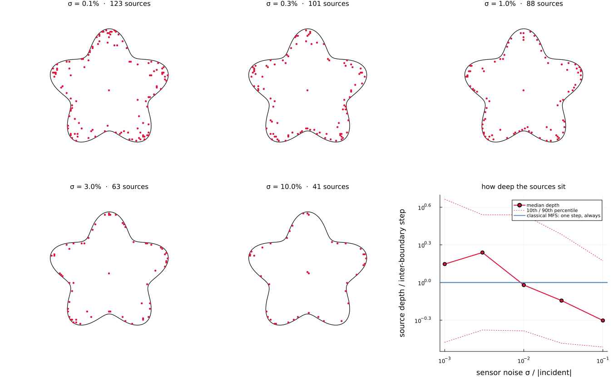

### 5. The layout is not a classical one

The selected sources do not sit on an offset curve, and nothing in the method would make them.
Their depths spread over **2.4 decades** — from 0.08 to 20.7 inter-boundary steps, median 1.8 —
where classical MFS uses one depth for all 200 sources. Thirty per cent sit inside one step of
the boundary, and a tail of seven sources reaches past five steps, one of them essentially at
the centre of the obstacle.

Curvature still attracts them, but only mildly: the ten curvature extrema cover 30% of the
boundary and hold 45% of the sources, a 1.5× enrichment. On the corner version this was the
dominant feature of the layout — sources piled into the five tips outright — and smoothing the
boundary largely dissolves it.

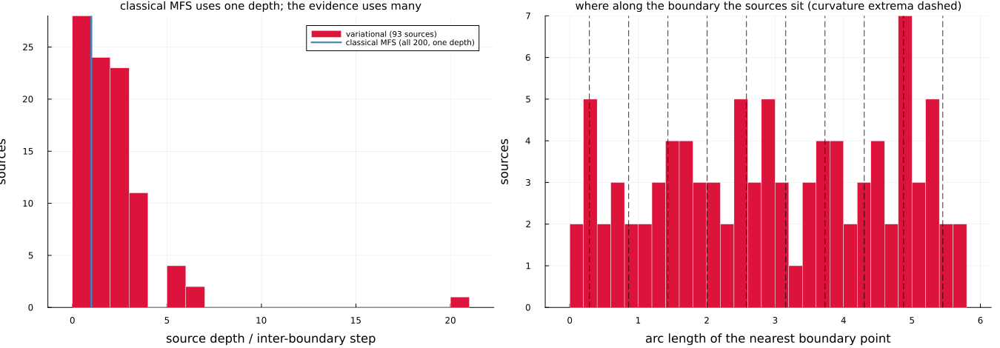

And because the answer is a posterior, the field comes with error bars everywhere, not just a
number on the boundary:

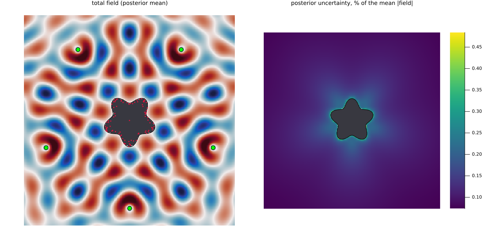

## A block under its own weight: the one problem whose interior answer is known

[`square-stress/gravity_square.jl`](square-stress/gravity_square.jl) takes the `Gravity
rectangle` testset of [`test/benchmarks_test.jl`](../../../test/benchmarks_test.jl) — a 2L × H
block of density ρ resting on the ground under gravity — and runs Phase 1 and Phase 2 as two
separate solves. It is the only example here with a **closed-form answer inside the domain**:

    σ_yy = ρ g (y - H),   σ_xx = σ_xy = 0,

so every method is scored on the **whole stress tensor at 625 points inside the block**, not on a
boundary residual. The particular solution `ParticularGravity()` supplies σ_yy = ρ g y — the right
body force, the wrong constant — leaving the MFS sources a homogeneous problem: produce a
**uniform** vertical compression σ_yy = -ρgH. Uniform is the awkward case for a basis of 1/r
fields, and that is what makes the placement question interesting here.

**The data are exact, and the solver is told they are noisy.** Each sensor reports the exact
traction, while the boundary `fields` carry a covariance of σ = 0.5% of ρgH. Keeping the assumed
noise keeps the regularisation — it is what tells the evidence when another source stops being
worth adding — while removing the realisation removes the part of the layout that is an accident
of the random seed. With a realisation in the data the selected layout came out visibly
asymmetric although the problem is not; without it, the question "where do the sources want to
be?" has a clean answer. The price is that `R/N_g` reads 0.11 instead of 1, correctly reporting a
residual far below the noise the solver was told to assume.

The benchmark's own comment is the point of the example: *"need some fiddling to choose the best
source distance and tolerance"*. Tikhonov gets there with `relative_source_distance = 1.24` and
`tolerance = 2e-7`, both found by hand. The variational solver is given a blind 41 × 41 grid of
1600 candidates outside the block (3200 coefficients against 160 data rows) and tunes nothing:

| | sources | chosen by hand | interior rms | interior worst | on the x = 0 slice |
|---|---|---|---|---|---|
| Tikhonov, offset 1.24 | 80 | offset **and** tolerance | 9.9% | 38.4% | 3.8% |
| variational, Phase 1 alone | 12 of 1600 | nothing | 0.183% | 0.474% | 0.146% |
| variational, Phase 1 + 2 | **12** | nothing | **0.136%** | **0.362%** | **0.113%** |

Phase 1 is run **on its own** with `max_iters = 0` — a default `VariationalBayesianSolver` call
selects and then falls straight into the Algorithm 1 loop, so its `elbo_history` is the two phases
concatenated and its answer is not the selection's. It stops after 63 actions. Phase 2 is then a
second solve entered at the positions *and* precisions Phase 1 finished with
(`select_sources_flag = false`, `prior_variance = 1 ./ vsol.prior_precisions`).

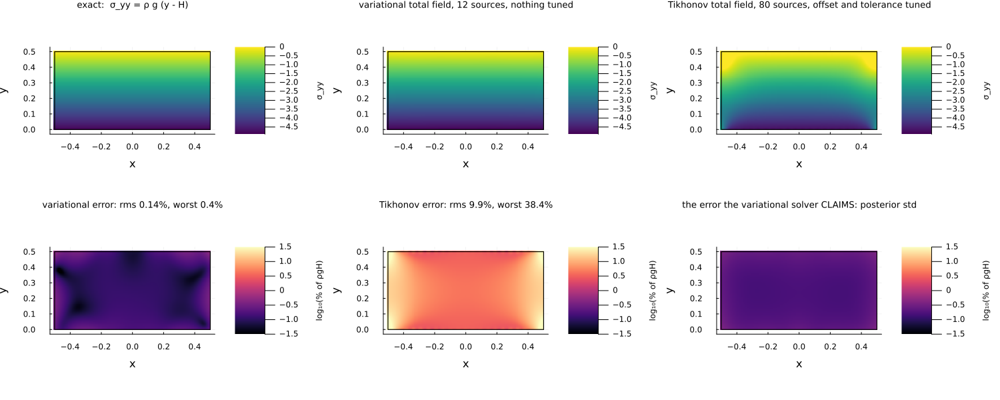

The middle panel below is the honest version of the same picture: at this accuracy the predicted
and exact σ_yy curves are indistinguishable, so the slice is worth looking at only with the exact
solution subtracted. The variational error never exceeds 0.12% of ρgH anywhere on the slice, with a
±2σ posterior band that covers the truth everywhere, while the hand-tuned Tikhonov fit sits
1.8–3.4% high along all of it — a systematic offset, not noise.

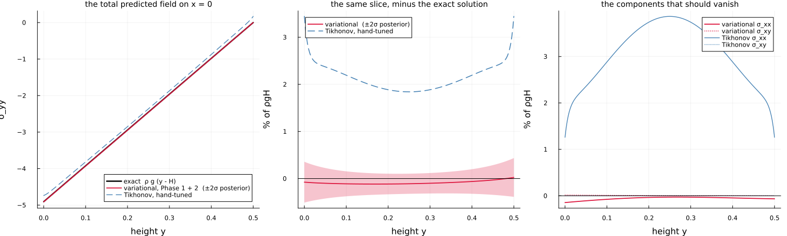

### What Phase 2 buys, and what the evidence can see

| | interior rms | interior worst |
|---|---|---|
| Phase 1 | 0.183% | 0.474% |
| + EM re-estimation of the precisions | 0.140% | 0.413% |
| + the M-step over the positions | **0.136%** | **0.362%** |

Most of the gain is the precision update rather than the moving; the position M-step slides the
sources a median 0.19 and at most 1.3 boundary steps off the grid and takes the worst point down a
further 12%. What is worth noting is that **the evidence cannot see any of it**: the bound ends
within 0.01 nat of where Phase 1 left it, because Phase 1's per-column precisions already maximize
that same bound coordinate-wise. What Phase 2 improves is the field *between* the sensors, and no
criterion evaluated *on* the sensors measures that.

### The layout is a physical construction, and it is symmetric

Nothing sits one step out from the boundary. Eight sources land **on the vertical axis**, stacked
far above and far below the block — the far-field squeeze that puts a slab into uniform
compression — plus two lateral **pairs** at x = ±1.125 and ±2.5 that trim the σ_xx the squeeze
leaves behind. The strongest coefficients sit 16–21 boundary steps out, where classical MFS puts
all 80 sources at 1.24.

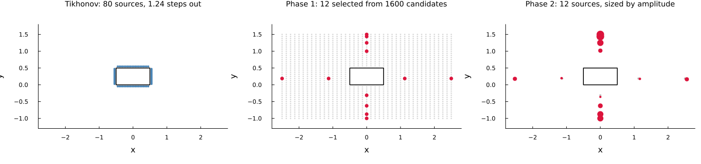

The problem is symmetric about x = 0 and, with the noise realisation gone, so is the answer:
measured as the distance from each source's mirror image to the nearest other source, **Phase 1
scores exactly zero**. That is worth pausing on — the selection is a sequence of greedy discrete
decisions with no notion of symmetry in it, and it recovers the problem's symmetry anyway, because
two mirror-image candidates have identical evidence and both get taken. Phase 2's position M-step
then loses 0.7 steps of it: it descends on one source at a time, so a symmetric pair is never moved
as a pair, and the lateral pair sits in the flattest direction the misfit has.

The layout is a property of the problem rather than of the grid — 416, 1600 and 3552 candidates
all select the **same twelve** sources:

| candidate grid | candidates | sources kept | interior rms |
|---|---|---|---|
| 21 × 21 | 416 | 12 | 0.219% |
| 41 × 41 | 1600 | 12 | 0.183% |
| 61 × 61 | 3552 | 12 | 0.137% |
| 81 × 81 | 6244 | 19 | 0.151% |

(At 6244 the grid gets fine enough that neighbouring candidates are nearly interchangeable and the
selection starts splitting single sources across pairs of them, without improving the field.)

How far out the box reaches is the setting that does matter:

| candidate box | candidates | sources kept | deepest kept (steps) | interior rms |
|---|---|---|---|---|
| 1.3× | 538 | 59 | 3.4 | 1.18% |
| 2× | 1202 | 30 | 10.5 | 0.207% |
| 3× | 1460 | 21 | 17.4 | 0.181% |
| 5× | 1600 | **12** | 42.0 | 0.183% |
| 8× | 1656 | **10** | 73.5 | 0.094% |

A box only 1.3 times the block spends 59 sources to land six times the error. A uniform stress is
cheap to build from far sources and expensive from near ones, which have to cancel each other
across the block — and with clean data that cost shows up in the error, where a noise realisation
would hide it under the noise floor.

### The posterior stays calibrated even though the noise is not there

On the x = 0 slice the truth lies inside the ±2σ band at **every** point, at a median z-score of
0.78, and the median posterior standard deviation (0.123% of ρgH) sits within 25% of the median
true error (0.099%). That is less of a coincidence than it looks: the assumed σ is what tells the
evidence when to stop adding sources, so it sets the accuracy the fit settles at, and it also sets
the width of the posterior — both land near a fifth of the assumed 0.5%. The right-hand panel below
shows the same thing on the boundary: the variational residual sits about six times below the
assumed noise across all 80 sensors, while the hand-tuned Tikhonov fit misses by 17× at the
corners.

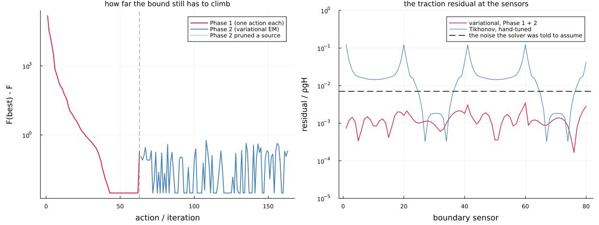

## Scattering from spikey obstacles: sources everywhere, ARD decides

[`spikey_scattering.jl`](spikey_scattering.jl) is the showcase: three strange obstacles
covered in spikes — a star and a shard with genuinely sharp (corner) spikes, and an urchin
with smooth but narrow ones — each carrying a **Dirichlet (sound-soft)** condition, lit by
an incident point source. Dirichlet obstacles are strong scatterers, and the three sit only
about half a wavelength apart, so the wave **rattles between them**: the multiple
scattering is visible as interference structure in the gaps.

With classical MFS this is exactly the kind of geometry where source placement is
make-or-break (see the [tear-drop example](../acoustic/teardrop_scattering.jl), where one
missing source at a cusp destabilises the whole fit). Here nobody thinks about placement:

- **Sources everywhere.** A blind regular grid carpets the inside of every obstacle
  (2619 candidates, 5238 coefficients — far more unknowns than the 1200 data). The grid
  does not know where the spikes are. (Sources must lie *inside* the obstacles, since each
  one is singular at its own position and the scattered field must be regular in the
  exterior.)
- **ARD prunes.** The solver learns a prior precision for every candidate coefficient and
  switches off the sources the data do not need, keeping ~180 of the 2619 in under a
  minute — clustered along the boundaries and reaching into the spike tips, all on its
  own (the run prints the exact pruning time).
- **Uncertainty for free.** The answer is a Gaussian posterior, so every point of the
  scattered field carries an uncertainty `s(x)`. The right panel of the main figure maps
  `s(x)` as a **percentage of the mean field magnitude** — it peaks at a few percent, and
  concentrates in the gaps between the obstacles, where the multiply-scattered field is
  hardest to pin down.

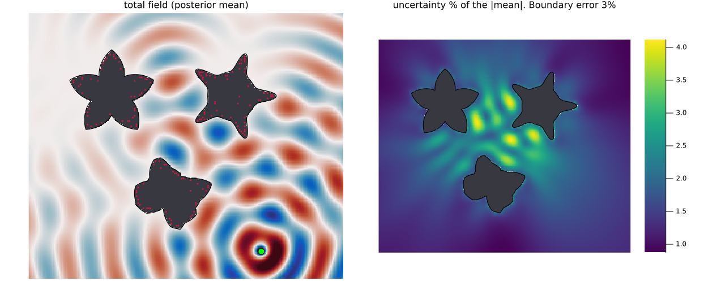

The posterior mean of the total field over one period:

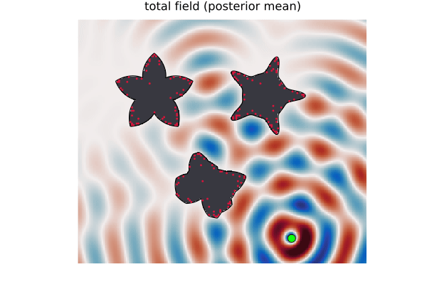

What ARD did to the blind grid:

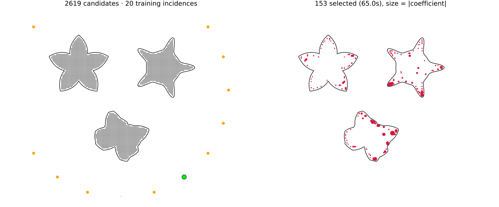

The Dirichlet condition is imposed as noisy data — every boundary sensor reports zero total
pressure to within a known noise σ (3% of the strongest boundary signal) — and the run
checks itself at fresh boundary points halfway between the sensors:

- `misfit_ratio ≈ 1.1`: the data are fitted to the specified noise level, not beyond it;
- the total field at fresh points is ≈ 0 to a few percent of the incident field;
- the posterior's own 3σ error bars cover the truth at ~90% of the fresh checks.

## Learning source positions for the Laplace equation

[`laplace_source_learning.jl`](laplace_source_learning.jl) reconstructs ten true point
sources from noisy boundary data on a disk, comparing ARD alone (sources everywhere, held
fixed) against ARD combined with the M-step over the source positions. It answers "can ARD
alone learn the sources?" — no: ARD is a subset selector, so recovering the true source
*positions* needs the position updates; but ARD alone is still an excellent *field* solver,
which is exactly how the scattering example above uses it.
